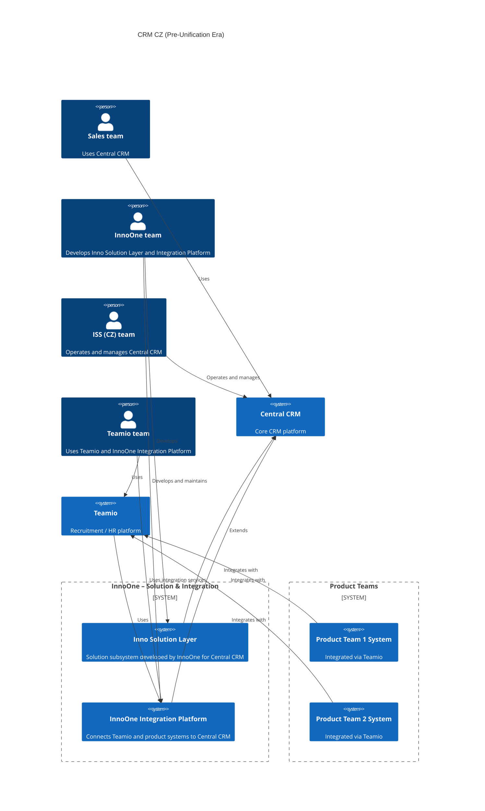
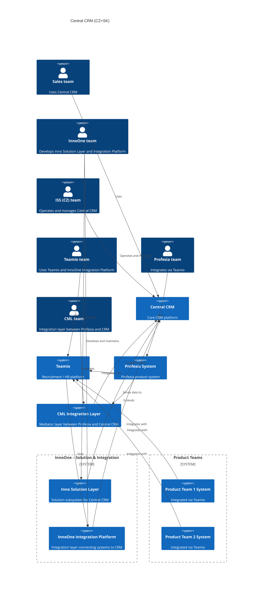

# 

```mermaid
C4Context
title CRM CZ (Pre-Unification Era)

Person(sales, "Sales team", "Uses Central CRM")
Person(inno, "InnoOne team", "Develops Inno Solution Layer and Integration Platform")
Person(iss, "ISS (CZ) team", "Operates and manages Central CRM")
Person(teamioTeam, "Teamio team", "Uses Teamio and InnoOne Integration Platform")

System(crm, "Central CRM", "Core CRM platform")

System_Boundary(innoBoundary, "InnoOne – Solution & Integration") {
    System(innoSolution, "Inno Solution Layer", "Solution subsystem developed by InnoOne for Central CRM")
    System(innoInt, "InnoOne Integration Platform", "Connects Teamio and product systems to Central CRM")
}

System(teamio, "Teamio", "Recruitment / HR platform")

System_Boundary(prodBoundary, "Product Teams") {
    System(prod1, "Product Team 1 System", "Integrated via Teamio")
    System(prod2, "Product Team 2 System", "Integrated via Teamio")
}

Rel(sales, crm, "Uses")
Rel(inno, innoSolution, "Develops")
Rel(inno, innoInt, "Develops and maintains")
Rel(iss, crm, "Operates and manages")
Rel(teamioTeam, teamio, "Uses")
Rel(teamioTeam, innoInt, "Uses integration services")

Rel(innoSolution, crm, "Extends")
Rel(innoInt, crm, "Integrates with")

Rel(prod1, teamio, "Integrates with")
Rel(prod2, teamio, "Integrates with")
Rel(teamio, innoInt, "Uses")

```

```mermaid
C4Context
title Central CRM (CZ+SK)

Person(sales, "Sales team", "Uses Central CRM")
Person(inno, "InnoOne team", "Develops Inno Solution Layer and Integration Platform")
Person(iss, "ISS (CZ) team", "Operates and manages Central CRM")
Person(teamioTeam, "Teamio team", "Uses Teamio and InnoOne Integration Platform")
Person(profesiaTeam, "Profesia team", "Integrates via Teamio")
Person(cmlTeam, "CML team", "Integration layer between Profesia and CRM")

System(crm, "Central CRM", "Core CRM platform")

System_Boundary(innoBoundary, "InnoOne – Solution & Integration") {
    System(innoSolution, "Inno Solution Layer", "Solution subsystem for Central CRM")
    System(innoInt, "InnoOne Integration Platform", "Integration layer connecting systems to CRM")
}

System(teamio, "Teamio", "Recruitment / HR platform")

System_Boundary(prodBoundary, "Product Teams") {
    System(prod1, "Product Team 1 System", "Integrated via Teamio")
    System(prod2, "Product Team 2 System", "Integrated via Teamio")
}

System(profesiaSys, "Profesia System", "Profesia product system")
System(cmlSys, "CML Integration Layer", "Mediator layer between Profesia and Central CRM")

Rel(sales, crm, "Uses")
Rel(inno, innoSolution, "Develops")
Rel(inno, innoInt, "Develops and maintains")
Rel(iss, crm, "Operates and manages")
Rel(teamioTeam, teamio, "Uses")

Rel(innoSolution, crm, "Extends")
Rel(innoInt, crm, "Integrates with")

Rel(prod1, teamio, "Integrates with")
Rel(prod2, teamio, "Integrates with")
Rel(teamio, innoInt, "Uses")

Rel(profesiaTeam, profesiaSys, "Uses")
Rel(profesiaSys, teamio, "Integrates with")
Rel(profesiaSys, cmlSys, "Sends data to")
Rel(cmlSys, crm, "Integrates with")
Rel(cmlTeam, cmlSys, "Manages")

```